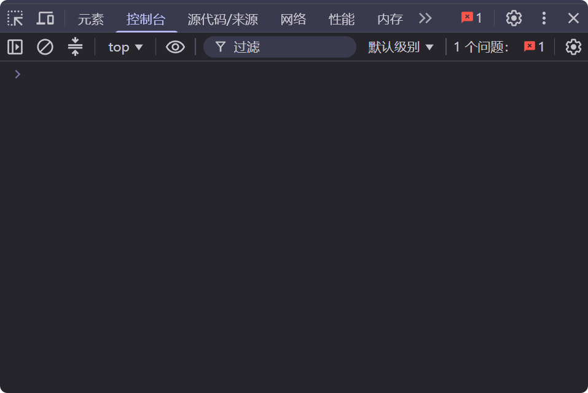
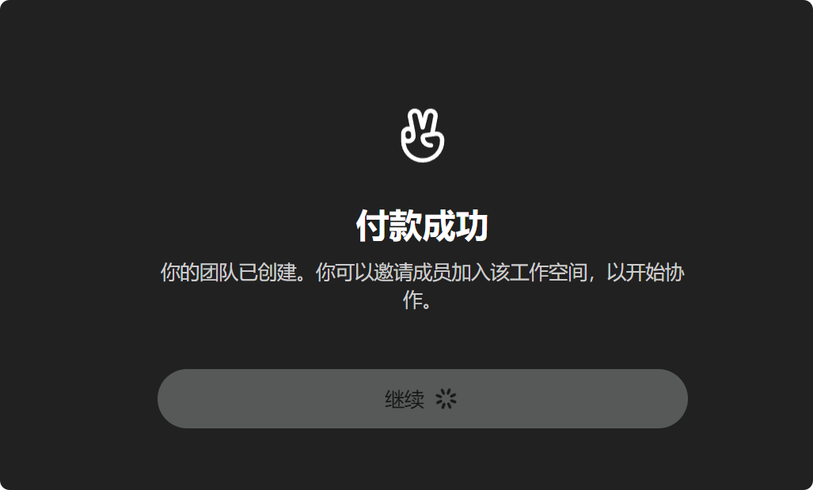

# ChatGPT Team 支付长链接生成教程

> 本教程通过浏览器控制台调用 ChatGPT 官方支付接口，生成带优惠码的 Stripe 结账长链接。

---

## 前置条件

- 已安装 Chrome 浏览器
- 拥有有效的 ChatGPT 账号（已登录）
- 持有可用的优惠码（Promo Code）

---

## 步骤一：登录 ChatGPT

用 Chrome 打开 [https://chatgpt.com](https://chatgpt.com)，确保已正常登录账号。

---

## 步骤二：打开浏览器开发者工具

按 `F12`（或 `Ctrl + Shift + I`）打开开发者工具，切换到 **Console（控制台）** 标签页。



---

## 步骤三：填写配置并运行脚本

将下方代码中的两处配置替换为你的实际信息：

| 配置项              | 说明                                                     |
|------------------|--------------------------------------------------------|
| `WORKSPACE_NAME` | 你想设置的团队工作区名称(可自定义，如 `"MyTeam"`)                        |
| `COUPON`         | 你拿到的优惠码(如 `"ramsacuk"`), 就是你拿到的chatgpt链接中`promoCode`的值 |
| `COUNTRY`        | 你的优惠码所属的国家                                             |
| `CURRENCY`       | 结算的货币,一般跟随你的优惠码地区,比如美区用美刀,英区用英镑,泰区用泰币                  |

替换完成后，将代码**完整粘贴**到控制台，按回车执行。

```js
(async function generateTeamLink() {
  // ================= 配置项 =================
  const WORKSPACE_NAME = "your_workspace_name";       // 工作区名称
  const COUPON = "your_us_coupon";    // 优惠码
  const SEAT_QUANTITY = 2;            // 席位数量(一般为2个)
  const COUNTRY = "US";               // 国家代码：GB / US / AU 等
  const CURRENCY = "USD";             // 货币代码：GBP / USD / AUD 等
  // ==========================================
    
   if (COUPON === "your_us_coupon" || WORKSPACE_NAME === "your_workspace_name") {
     console.error("❌ 请先替换配置项中的 WORKSPACE_NAME 和 COUPON 再运行！");
     return;
   }
   
   if (SEAT_QUANTITY < 2) {
     console.error("❌ 席位数量最少为 2");
     return;
   }

  console.log("⏳ 正在获取 ChatGPT Session Token...");

  let accessToken;
  try {
    const s = await fetch("/api/auth/session").then(r => r.json());
    accessToken = s?.accessToken;
    if (!accessToken) throw new Error("accessToken 为空，请确认已登录 ChatGPT 账号");
  } catch (e) {
    console.error("❌ 获取 Token 失败：", e.message);
    return;
  }
  console.log("✅ Token 获取成功");

  const payload = {
    plan_name: "chatgptteamplan",
    team_plan_data: {
      workspace_name: WORKSPACE_NAME,
      price_interval: "month",
      seat_quantity: SEAT_QUANTITY
    },
    billing_details: {
      country: COUNTRY,
      currency: CURRENCY
    },
    cancel_url: "https://chatgpt.com/",
    promo_code: COUPON,
    checkout_ui_mode: "hosted"
  };

  console.log("⏳ 正在请求 Stripe 支付长链接...");
  try {
    const resp = await fetch(
      "https://chatgpt.com/backend-api/payments/checkout",
      {
        method: "POST",
        headers: {
          Authorization: `Bearer ${accessToken}`,
          "Content-Type": "application/json"
        },
        body: JSON.stringify(payload)
      }
    );
    const data = await resp.json();

    if (!resp.ok) {
      console.error(`❌ 请求失败 HTTP ${resp.status}`);
      console.log("📋 响应详情：", data);
      return;
    }

    const hostedUrl = data?.url || data?.stripe_hosted_url || data?.checkout_url;
    if (!hostedUrl) {
      console.warn("⚠️ 未找到长链接，原始响应：", data);
      return;
    }

    console.log("─".repeat(60));
    console.log("✅ ChatGPT Team 链接生成成功！");
    console.log(`📌 工作区名称 : ${WORKSPACE_NAME}`);
    console.log(`💺 席位数量   : ${SEAT_QUANTITY}`);
    console.log(`🎟️  优惠码     : ${COUPON}`);
    console.log(`🌍 地区/货币   : ${COUNTRY} (${CURRENCY})`);
    if (data.checkout_session_id) {
      console.log(`🆔 Session ID : ${data.checkout_session_id}`);
    }
    console.log("─".repeat(60));
    console.log("🔗 Stripe 支付长链接（复制到浏览器打开）：");
    console.log(hostedUrl);
    console.log("─".repeat(60));
  } catch (e) {
    console.error("❌ 网络异常或请求失败：", e.message);
  }
})();
```

---

## 步骤四：打开链接完成支付

- 控制台输出成功后，复制 `🔗` 后面的长链接，在**浏览器新标签页**中打开
- 检查结算价格是否有误，若有误，则需根据**脚本信息**和**控制台信息**排查
- 价格无误，即可按页面提示填写银行卡信息完成付款



---

## 常见问题

**Q：执行后提示 `accessToken 为空`？**
重新刷新 chatgpt.com 页面，确认已登录，再重试

**Q：HTTP 状态码 `401` 或 `403`？**
登录态已过期，退出后重新登录，再执行脚本

**Q：返回 `200` 但找不到链接字段？**
接口返回结构可能有变化，展开控制台中的原始响应对象，手动查找包含 `https://checkout.stripe.com` 的字段

---

> ⚠️ **注意**：本脚本仅在你本人已登录的 ChatGPT 账号会话中运行，不会将任何凭证发送到第三方服务器。优惠码具有使用限制，请勿滥用。


